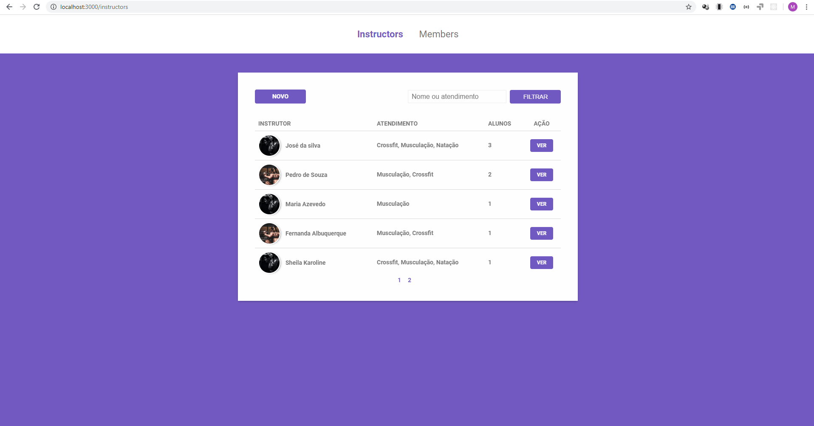
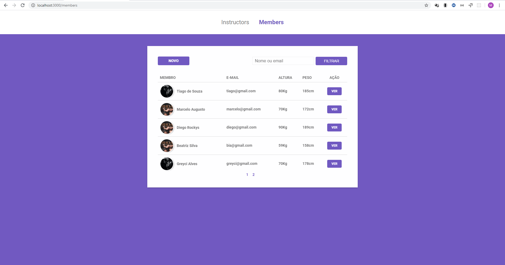
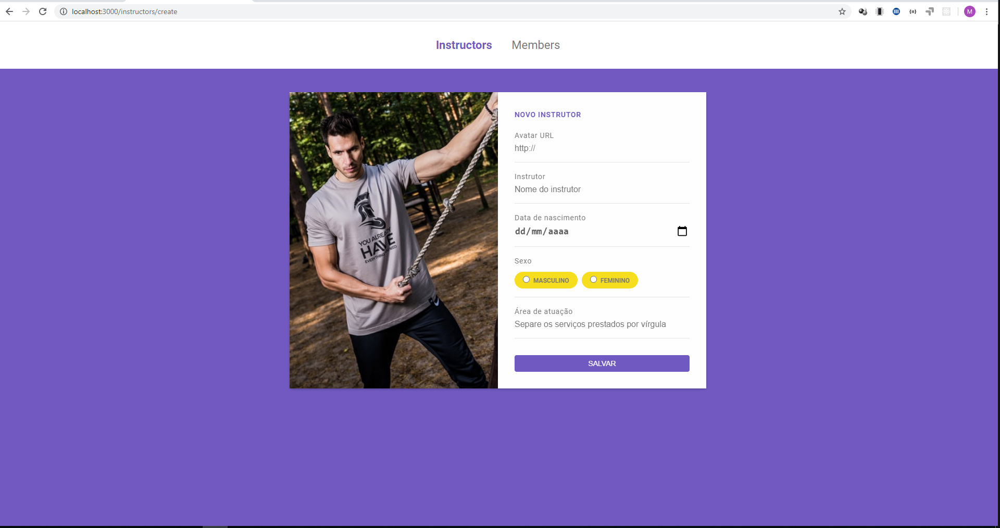
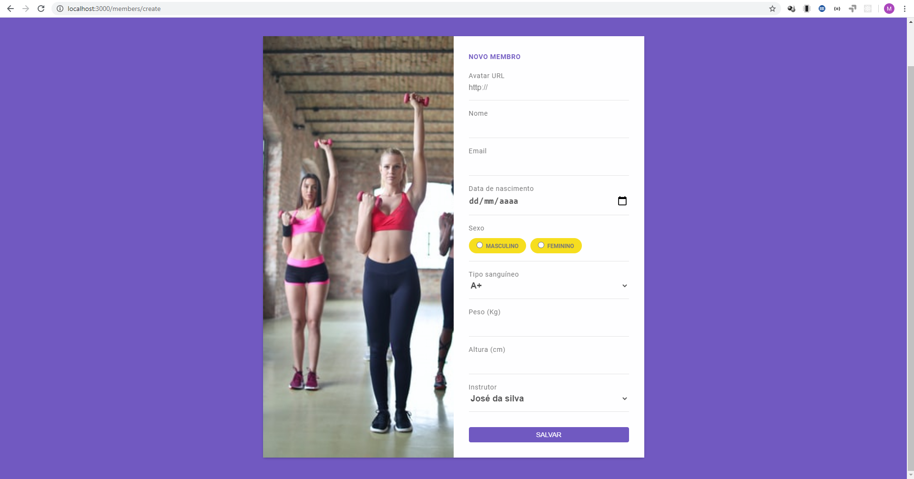
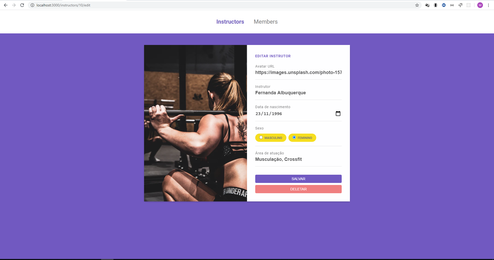
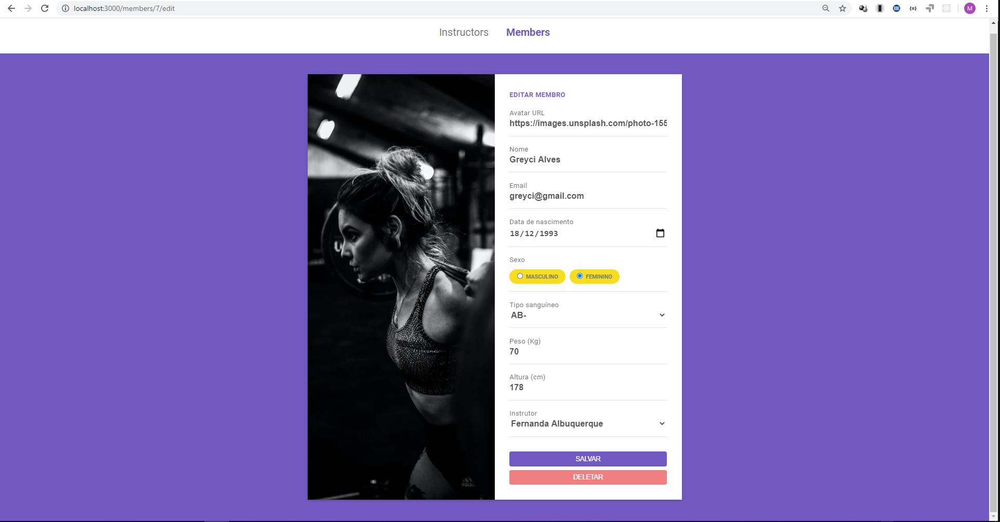
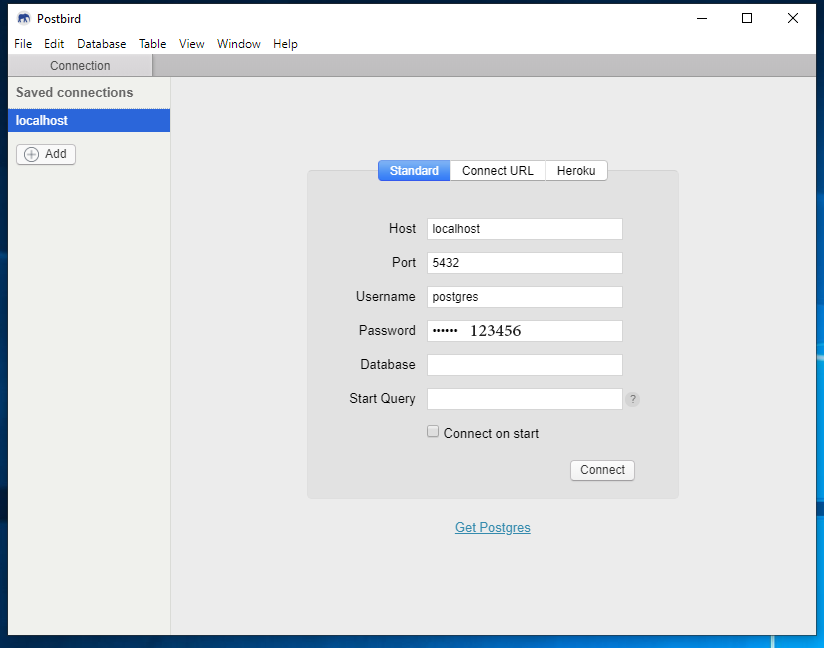
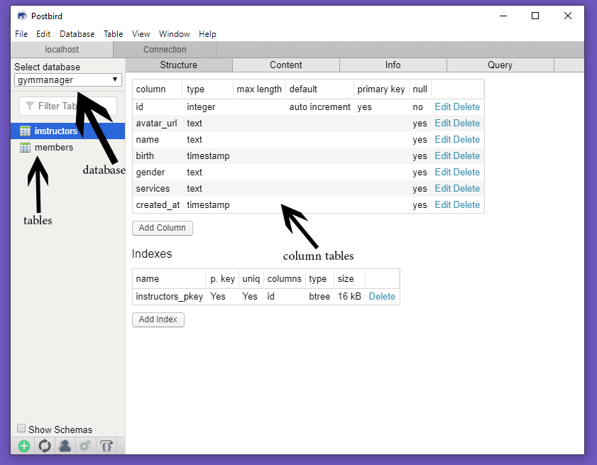

# gym-management 🏋️‍

Made with nunjucks, js, express and postgresSQL

<p align="center">
   
  
  
  
  
  
  
  
  
  
   
</p>

********************************

# gym-management - 🏋

[](https://github.com/maiconboer)

********************************

# :construction_worker: Installation

**You need to install [Node.js] and [NPM] first, then, clone the repository:**

```git clone https://github.com/maiconboer/gym-management.git```

**Install dependencies**

```npm install```  
(express, method-override, nunjucks and pg) - dependencies  
(browser-sync, nodemon and npm-run-all) - devDependencies  


**Install and configure Database**   
[Postgres](https://www.postgresql.org/download/)    
[Postbird](https://www.electronjs.org/apps/postbird)  

**After installing postgresql and postbird, create a database and 2 tables, according to the instructions below:  
Open postbird and configure conformer data and image below:**   

- Host: localhost  
- port: 5432  
- Username: postgres  
- password: 123456  

   

**In SELECT DATABASE, select: CREATE DATABASE with the following data:**    

- Database: gymmanager  
- template1  
- UTF8  

After creating the bank, we will create 2 tables, the first for **instructors** and the second for **members**:
Right click on the left column and select CREATE TABLE 

**Table name: instructors**  

With the table created, click on it and click on ADD COLUMN:  
(we will create 6 columns, as below):  

name:    |  avatar_url                             
---------| ------
type:   | text
check:   | Allow null

name:    | name  
---------| ------
type:    |text  
check:    |Allow null  

 


name:    |birth   
--------- | ------  
type: | timestamp without time zone   
check: | Allow null   

name: | gender  
--------- | ------  
type: | text  
check:  |Allow null  

name: | services  
--------- | ------  
type: | text    
check:  | Allow null    

name: | created_at  
--------- | ------  
type: | timestamp without time zone  
check:  | Allow null  

*****************************************

We finished the first table, now we will create the second table:  

Right click on the left column and select CREATE TABLE  

**Table name: members**  

With the table created, click on it and click on ADD COLUMN:  
(we will create 9 columns, as below):  

name: | name
--------- | ------ 
type: | text
check: | Allow null

name: | avatar_url
--------- | ------ 
type: | text
check: | Allow null

name: | email
--------- | ------ 
type: | text
check: | Allow null

name: | gender
--------- | ------ 
type: | text
check: | Allow null

name: | birth
--------- | ------ 
type: | timestamp without time zone
check: | Allow null

name: | blood
--------- | ------ 
type: | text
check: | Allow null

name: | weight
--------- | ------ 
type: | Integer
check: | Allow null

name: | height
--------- | ------ 
type: | Integer
check: | Allow null

name: | instructor_id
--------- | ------ 
type: | Integer
check: | Allow null

*****************************************

# :runner: Getting Started

We finished the second table, we can now run the project.

**To run the project, run the line below in the terminal:** 

**npm start**

